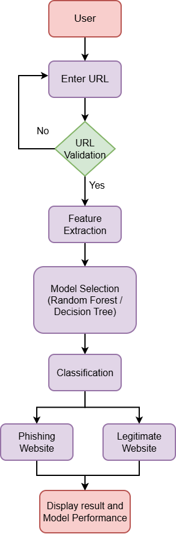
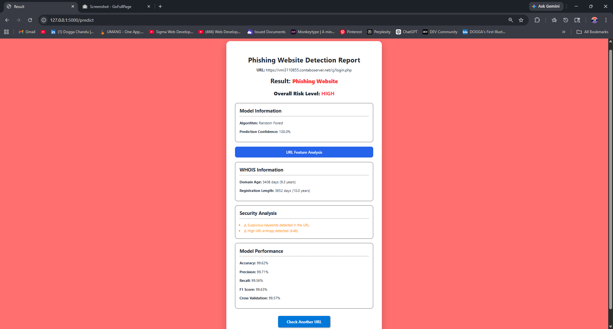
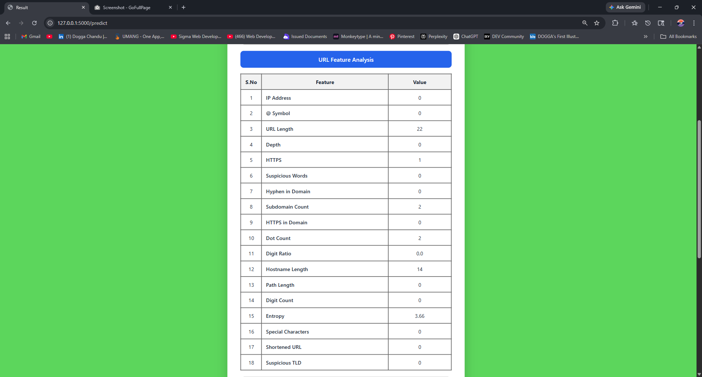

# Phishing Website Detection using Machine Learning

A machine learning-based web application that analyzes website URLs and classifies them as either **Phishing Website** or **Legitimate Website**.

The system extracts multiple URL-based features such as URL length, IP address presence, HTTPS usage, suspicious words, subdomain count, URL entropy, special characters, shortened URL usage, and suspicious TLDs. These features are provided to trained machine learning models to generate the prediction.

The application is developed using **Python, Flask, HTML, CSS, and Machine Learning**. It provides users with a simple web interface where they can enter a URL, select a machine learning model, and view the detection result and model performance.

## Project Objective

The main objective of this project is to develop a machine learning-based system that can identify potentially phishing URLs by analyzing their structural and lexical characteristics. The system will provide a convenient interface for testing URLs and displaying the classification results.

## Features

- **URL Input:** Allows users to enter a website URL for analysis.
- **URL Validation:** Checks whether the entered URL follows the required format.
- **Machine Learning Model Selection:** Allows users to select between Random Forest and Decision Tree models.
- **URL Feature Extraction:** Extracts important characteristics from the URL, including IP address presence, URL length, HTTPS usage, suspicious words, hyphens, subdomains, dots, digit ratio, entropy, special characters, shortened URLs, and suspicious TLDs.
- **Phishing Detection:** Classifies the submitted URL as either a phishing website or a legitimate website.
- **Model Comparison:** Provides prediction results from the available machine learning models.
- **Prediction Confidence:** Displays the confidence associated with the model prediction.
- **URL Feature Analysis:** Displays the extracted numerical features of the submitted URL.
- **Model Performance:** Displays accuracy, precision, recall, F1 score, and cross-validation results.
- **WHOIS Information:** Displays available domain-related information such as domain age and registration length.
- **Security Analysis:** Displays detected suspicious indicators associated with the analyzed URL.
- **Repeated URL Testing:** Allows users to return to the home page and analyze another URL.

## Technologies Used

### Programming Language
- **Python** — Used for data processing, feature extraction, machine learning model development, and backend application logic.

### Web Technologies
- **HTML** — Used to create the structure of the web pages.
- **CSS** — Used to design and style the web interface.
- **Flask** — Used as the Python web framework to connect the user interface with the machine learning functionality.

### Machine Learning
- **Scikit-learn** — Used to train and evaluate the Decision Tree and Random Forest classification models.
- **Decision Tree** — Used as one of the classification algorithms for phishing URL detection.
- **Random Forest** — Used as another classification algorithm for phishing URL detection.

### Data Processing
- **Pandas** — Used for loading, processing, organizing, and preparing the dataset.
- **NumPy** — Used for numerical operations and handling feature data.

### Model Storage
- **Pickle** — Used to save and load the trained machine learning models and related model information.

### Development Environment
- **Visual Studio Code** — Used for developing and managing the project files.

## Project Structure

```text
Phishing-Detection-Project/
│
├── static/
│   └── style.css
│
├── templates/
│   ├── index.html
│   ├── result.html
│   └── comparison.html
│
├── .gitignore
├── accuracy.txt
├── app.py
├── convert_dataset.py
├── dt_confusion_matrix.png
├── dt_model.pkl
├── features.py
├── model.py
├── rf_confusion_matrix.png
├── rf_model.pkl
└── whois_utils.py
```

## File and Folder Description

| File / Folder | Purpose |
|---|---|
| `static/style.css` | Contains CSS styles used to design and format the web application interface. |
| `templates/index.html` | Provides the main page where the user enters a URL and selects a machine learning model. |
| `templates/result.html` | Displays the prediction result, URL analysis, WHOIS information, and model performance. |
| `templates/comparison.html` | Displays the comparison between the Random Forest and Decision Tree models. |
| `.gitignore` | Specifies files and folders that should not be tracked by Git. |
| `accuracy.txt` | Stores model performance information used by the application. |
| `app.py` | Main Flask application that handles user requests, URL processing, model selection, prediction, and result rendering. |
| `convert_dataset.py` | Processes and converts the collected dataset into the required format. |
| `dt_confusion_matrix.png` | Confusion matrix visualization for the Decision Tree model. |
| `dt_model.pkl` | Saved trained Decision Tree machine learning model. |
| `features.py` | Contains functions used to extract numerical features from URLs. |
| `model.py` | Used to train and evaluate the machine learning models and save the trained models. |
| `rf_confusion_matrix.png` | Confusion matrix visualization for the Random Forest model. |
| `rf_model.pkl` | Saved trained Random Forest machine learning model. |
| `whois_utils.py` | Contains utility functions for retrieving and processing WHOIS-related domain information. |

## Dataset

The project will use two main types of URL datasets for training and evaluation:

### 1. Phishing Dataset

The phishing dataset will contain URLs identified as malicious or phishing websites. The project will use phishing URLs collected from sources such as PhishTank. These URLs will be processed and converted into numerical features before being used for machine learning.

### 2. Legitimate Dataset

The legitimate dataset will contain URLs belonging to trusted and commonly used websites. Sources such as Tranco and manually curated legitimate URL lists will be used to provide examples of non-phishing websites.

### Dataset Processing

The collected URLs will be cleaned and processed before model training. Invalid, incomplete, and duplicate URLs will be removed. The datasets will then be converted into structured numerical feature data using the feature extraction functions implemented in `features.py`.

The extracted features will include:

- IP address presence
- URL length
- `@` symbol presence
- URL depth
- HTTPS usage
- Suspicious words
- Hyphen presence
- Subdomain count
- Dot count
- Digit ratio
- URL entropy
- Special character count
- Shortened URL detection
- Suspicious TLD detection

The resulting numerical features will be used as inputs to the Decision Tree and Random Forest machine learning models.

> **Note:** The original dataset files are not included in this repository because of their size and are excluded through `.gitignore`.

## Installation and Setup

### 1. Clone the Repository
Clone the project repository to your local system:
```bash
git clone https://github.com/Rakesh-Dogga/Phishing-Detection-Project.git
```
Navigate to the project directory: 
```bash
cd Phishing-Detection-Project
```

### 2. Create a Virtual Environment
Create a Python virtual environment:
```bash
python -m venv venv
```

Activate the virtual environment on Windows:
```bash
venv\Scripts\activate
```

### 3. Install Required Libraries
Install the required python libraries:
```bash
pip install flask pandas numpy scikit-learn
```
if additinal libraries are required by whois_utils.py, install those libraries as well.

### 4. Run the application
Start the Flask application:
```bash
python app.py
```

The application will run locally and can be accessed through the URL displayed in the termonal, typically:
```Plain text
http://127.0.0.1:5000
```

### 5. Use the application
1. Enter a valid website URL.
2. Select a machine learning model.
3. Click **Detect**.
4. The system will extract URL features.
5. The selected model will classify the URL.
6. The result and model information will be displayed.
7. Use **Check another URL** to analyze another URL.


## How It Works
The system follows a sequence of steps to analyze a website URL and determine whether it is potentially phishing or legitimate.

### Workflow
1. **Enter URL:** The user enters a website URL into the application.
2. **URL Validation:** The system checks whether the entered URL follows the required format.
3. **Feature Extraction:** The system analyzes the URL and extracts relevant features such as URL length, IP address presence, HTTPS usage, suspicious words, subdomains, special characters, entropy, shortened URL usage, and suspicious TLDs.
4. **Model Selection:** The user selects a machine learning model such as **Decision Tree** or **Random Forest**.
5. **Prediction:** The extracted URL features are provided to the selected trained machine learning model.
6. **Classification:**
   The model classifies the URL as either:
   - **Phishing Website**
   - **Legitimate Website**
8. **Result Display:** The application displays the prediction result along with relevant URL analysis and model information.
9. **Model Performance:** The application can display model performance information such as accuracy, precision, recall, F1 score, and cross-validation results.

### Overall Process
<p align="center">
   </img>
</p>

## Machine Learning Models
The project uses two supervised machine learning classification algorithms to detect phishing websites based on extracted URL features.
### 1. Decision Tree
The Decision Tree algorithm classifies URLs by making a sequence of decisions based on their extracted features. Each decision splits the data according to feature values until a final classification is reached.
In this project, the trained Decision Tree model is stored in:
```text
dt_model.pkl
```
### 2. Random Forest
The Random Forest algorithm uses multiple decision trees and combines their predictions to produce the final classification. It is used to analyze the extracted URL features and classify the URL as phishing or legitimate.
In this project, the trained Random Forest model is stored in:
```text
rf_model.pkl
```
### Model Comparison
The application allows users to select and use either model for URL classification. It also provides a comparison of the model predictions and performance.
The project includes confusion matrix visualizations for both models:
- `dt_confusion_matrix.png`
- `rf_confusion_matrix.png`

## Project Screenshots

### Home Page

The home page allows the user to enter a website URL and select a machine learning model for detection.


### Detection Result

The result page displays whether the analyzed URL is classified as a phishing or legitimate website.



### Model Comparison

The comparison page displays the predictions and performance information of the Decision Tree and Random Forest models.


### URL Feature Analysis

The application displays the extracted URL features used for the machine learning prediction.


